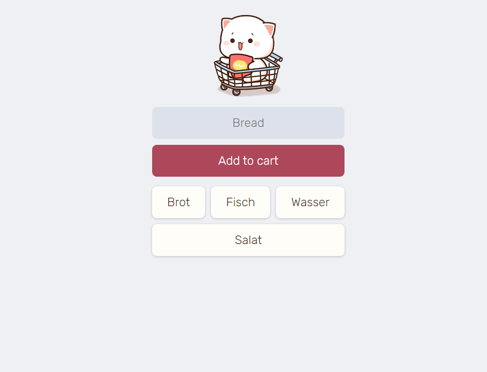

# Shopping-List

Dieses Projekt ist eine einfache Webanwendung, mit der Benutzer Einkaufslisten erstellen und verwalten können. Die Anwendung verwendet Firebase Realtime Database für die Datenspeicherung.

## Funktionen
- Benutzer können Gegenstände zur Einkaufsliste hinzufügen.
- Die Einkaufsliste wird in Echtzeit aktualisiert und angezeigt.
- Benutzer können Gegenstände aus der Liste entfernen, indem sie auf sie klicken.

## Vorschau

## Technologien
- HTML
- CSS
- JavaScript
- Firebase Realtime Database
